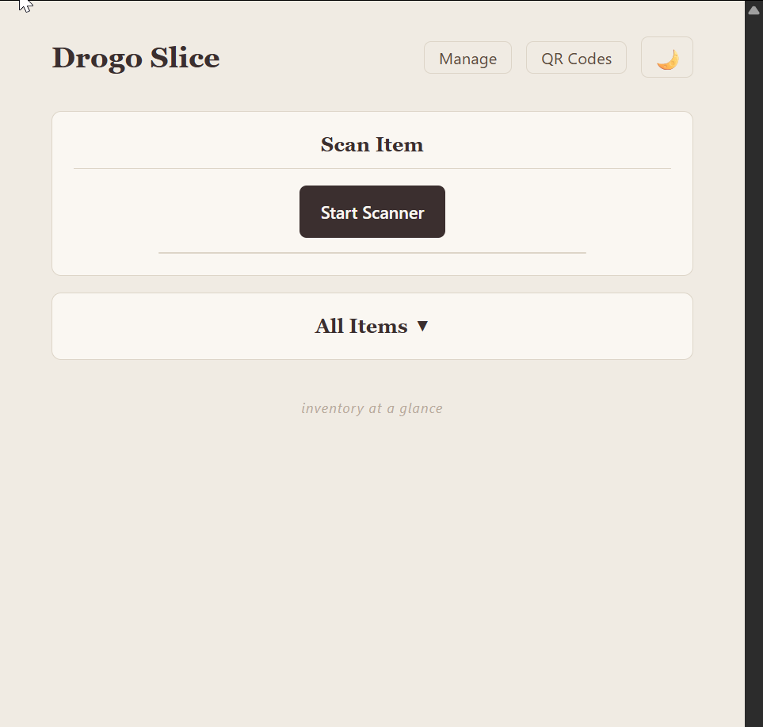

# Drogo Slice

Coffee shop inventory tracker built with FastAPI and PostgreSQL.




## Running locally (Docker installed and running)

```bash
docker compose up --build
```

App runs at `http://localhost:8000`. API docs at `/docs`.

## Development workflow

The Docker setup supports **hot-reloading** — edit code in VS Code and changes appear automatically without rebuilding.

1. Start the stack once: `docker compose up --build`
2. Edit code in VS Code — files sync into the container via a volume mount
3. Uvicorn detects changes and auto-restarts the API
4. Only rebuild (`docker compose up --build`) when you change `requirements.txt`

For subsequent sessions, just run `docker compose up` (no `--build` needed).

## Environment variables

| Variable | Description |
|---|---|
| `DATABASE_URL` | PostgreSQL connection string (asyncpg) |
| `ADMIN_USERNAME` | Basic auth username |
| `ADMIN_PASSWORD` | Basic auth password |

See `.env.example` for defaults.

## Security

All endpoints (except `/health`) require HTTP Basic Auth. Credentials are set via `ADMIN_USERNAME` and `ADMIN_PASSWORD` environment variables.

## Testing

```bash
docker compose exec api pytest
```
